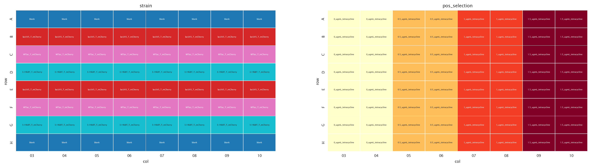
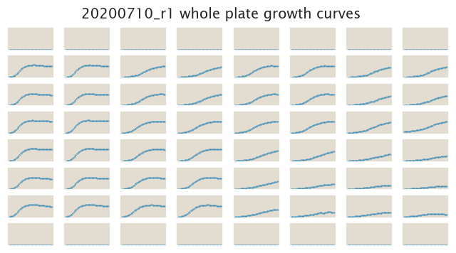
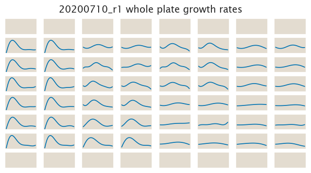

# 2020-07-09 Plate Reader Growth Measurement

## Purpose
The objective of this experiment is to test the growth of the 3 different
promoters (lacUV5, WTlac, 3.19kBT) on tetracycline.

## Strain Information

| Plasmid | Genotype | Host Strain | Shorthand |
| :------ | :------- | ----------: | --------: |
| `pZS4*5-mCherry`| `galK<>2*lacUV5-tetA-C51m` | HG105 |`UV5 mCh` |
| `pZS4*5-mCherry`| `galK<>2*WTlac-tetA-C51m` | HG105 |`WT mCh` |
| `pZS4*5-mCherry`| `galK<>2*3.19kBT-tetA-C51m` | HG105 |`3.19 mCh` |

## Plate Layout

**96 plate layout**

## Notes & Observations

This experiment had a 5x higher concentration the initial inoculum compared with
previous experiments.

## Analysis Files

**Whole Plate Growth Curves**

**Whole Plate Growth Rate Inferences**

## Experimental Protocol

1. Cells as described in "Strain Information" were grown to saturation in 4 mL
   of LB + Kan + Spec in 15 mL culture tubes at 37ºC and 250 rpm.

2. Cells were diluted 1:4000 into 4 mL of M9 + 0.5% glucose + Kan + Spec after ≈
   8 hours of growth in LB. These M9 cultures were grown overnight at 37ºC and
   250 rpm.

3. 1 mL of M9 saturated culture was spun down at top speed for 30 seconds. The
   formed pellet was resuspended in 200 µL of fresh M9 for a 5x concentration of
   the cells.

3. 5 µL of the concentrated M9 culture was then added into 300 µL of M9  with
   different tetracycline concentrations according to the plate layout
   information.

4. The plate was placed in a Biotek Gen5 plate reader and grown at 37ºC, shaking
   in a linear mode at the fastest speed. OD600 and YFP Measurements were taken
   every 20 minutes for approximately 24 hours.

# Conclusions

The data makes no sense whatsoever. Useless dataset.