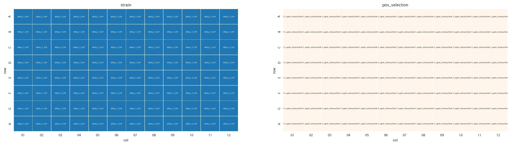
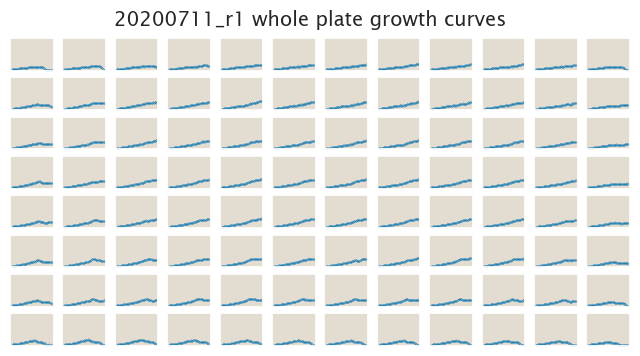
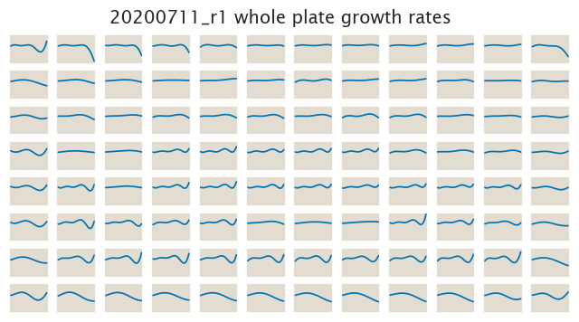

# 2020-07-11 Plate Reader Growth Measurement

## Purpose
The purpose of this experiment is to address the lack of reproducibility across
wells in the plate. With a single strain in the same media the objective was to
observe variability in the growth curves as a function of the position in a 
96-well plate

## Strain Information

| Plasmid | Genotype | Host Strain | Shorthand |
| :------ | :------- | ----------: | --------: |
| `pZS4*5-CFP`| `galK<>25O1+11-tetA-C51m` |  HG105 |`WT - CFP` |

## Plate Layout

**96 plate layout**

## Notes & Observations
The amount of cells inoculated at the beginning of this experiment was roughly
5x from the usual amount as the cells were concentrated before inoculation.

## Analysis Files

**Whole Plate Growth Curves**

**Whole Plate Growth Rate Inferences**

## Experimental Protocol

1. Cells as described in "Strain Information" were grown to saturation in 0.5 mL
   of LB in a deep 96 well plate.

2. Cells were diluted 1:4,000 into M9 + 0.5% glucose media on a new deep 96 well
   plate 12 hours before the experiment for cells to be at exponential growth.

3. 2.5 mL of saturated M9 culture were then spun down for 30 sec at top speed.
   The pellet was resuspended in 500 µL of fresh media for a 5x concentration.

4. 5 µL of the concentrated culture were inoculated into 300 µL of M9 + **1.5
   µg/mL tetracycline**.

5. The plate was placed in a Biotek Gen5 plate reader and grown at 37ºC, shaking
   in a linear mode at the fastest speed. Measurements were taken every 25
   minutes for 30 hours.

# Conclusions

The conclusions are based on a qualitative assessment of the data from the
`growth_plate_reader_exploration.ipynb` file.

From the data we can see that the usual range of wells we use C03-F10 or even
B03-G10 are in the clear for reproducible analysis. This might not be the best
concentration of tetracycline to have tested. Probably 1 µg/mL would have been a
better choice.