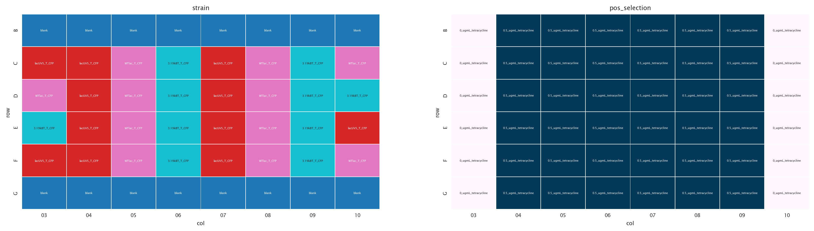
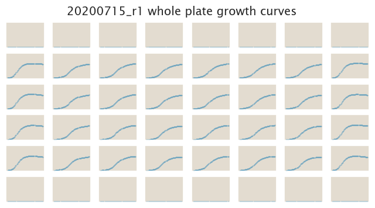
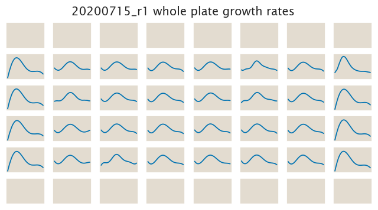

# 2020-07-15 Plate Reader Growth Measurement

## Purpose
The purpose of this experiment is to obtain high precision measurements of cell
growth in M9 minimal media with 0.5 µg/mL tetracycline.

## Strain Information

| Plasmid | Genotype | Host Strain | Shorthand |
| :------ | :------- | ----------: | --------: |
| `pZS4*5-CFP`| `galK<>2*lacUV5-tetA-C51m` | HG105 |`UV5 CFP` |
| `pZS4*5-CFP`| `galK<>2*WTlac-tetA-C51m` | HG105 |`WT CFP` |
| `pZS4*5-CFP`| `galK<>2*3.19kBT-tetA-C51m` | HG105 |`3.19 CFP` 

## Plate Layout

**96 plate layout**

## Notes & Observations

In this experiment we only use a single tetracycline concentration in the hope
to get higher reproducibility for multiple technical replicates in the same
plate. The tetracycline concentration was based on the results from `20200714`
in which 1 µg/mL seemed too high.

Instead of concentrating the cells by spinning them down as in `20200714` here
we opted for simply inoculating 10 µL of the saturated M9 culture.

## Analysis Files

**Whole Plate Growth Curves**

**Whole Plate Growth Rate Inferences**

## Experimental Protocol

1. Cells as described in "Strain Information" were grown to saturation in 4 mL
   of LB + Kan + Spec in 15 mL culture tubes at 37ºC and 250 rpm.

2. Cells were diluted 1:1000 into 4 mL of M9 + 0.5% glucose + Kan + Spec after ≈
   8 hours of growth in LB. These M9 cultures were grown overnight at 37ºC and
   250 rpm.

3. 10 µL of the saturated M9 culture was then added into 300 µL of M9  with
   different tetracycline concentrations according to the plate layout
   information.

4. The plate was placed in a Biotek Gen5 plate reader and grown at 37ºC, shaking
   in a linear mode at the fastest speed. OD600 and YFP Measurements were taken
   every 25 minutes for approximately 24 hours.

## Conclusions

The conclusions here come from a qualitative assessment of the data done with
the `growth_plate_reader_exploration.ipynb` notebook.

This is the most reproducible data we've gotten so far. The only problem is that
even among strains that should be different there is perfect overlap. This could
mean that 0.5 µg/mL of tetracycline is too low of a concentration and needs to
be increased.