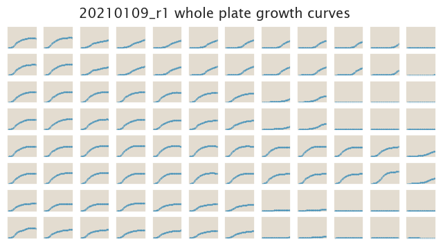

# 2021-01-10 Plate Reader Growth Measurement

## Purpose
Here we do a first experiment with strains containing various promoters and tetA, as well as RiboJ to reduce possible differences in mRNA stability due to varying 5'UTR.

## Strain Information

| Plasmid | Genotype | Host Strain | Shorthand |
| :------ | :------- | ----------: | --------: |

## Notes & Observations

## Analysis Files

**Whole Plate Growth Curves**

**Whole Plate Growth Rate Inferences**

## Experimental Protocol

## Conclusion