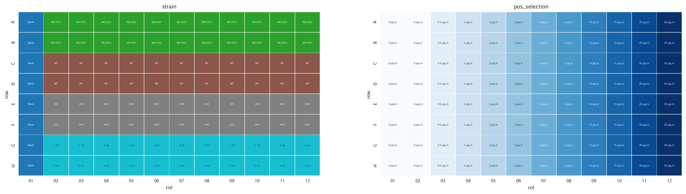
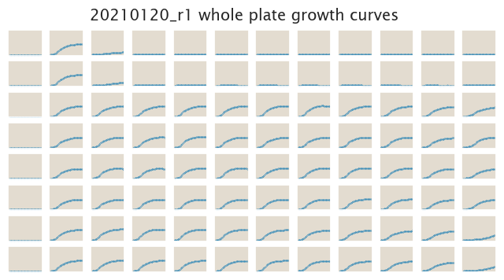

# 2021-01-20 Plate Reader Growth Measurement

## Purpose
Here we do a first experiment with strains containing various promoters and tetA, as well as RiboJ to reduce possible differences in mRNA stability due to varying 5'UTR.

## Strain Information

| Plasmid | Genotype | Host Strain | Shorthand |
| :------ | :------- | ----------: | --------: |
| -| -| MG1655 | MG1655 |
| -| galK<> WT-O2[tetR]-riboJ-tetA-sfGFP| MG1655 | WT |
| -| galK<> UV5-O2[tetR]-riboJ-tetA-sfGFP| MG1655 | UV5 |
| -| galK<> 3.19-O2[tetR]-riboJ-tetA-sfGFP| MG1655 | 3.19 |

## Plate Layout

**96 plate layout**

## Notes & Observations
For this experiment we used new 96-well plates from Eppendorf that are build with an extra space outside the outer wells that can be filled with water to prevent evaporation in the wells on the outside. While there was no visible evaporation in this experiment, we need to quantitatively compare growth rates across the plates, which we will do next.

## Analysis Files

**Whole Plate Growth Curves**

**Whole Plate Growth Rate Inferences**

## Experimental Protocol

## Conclusion