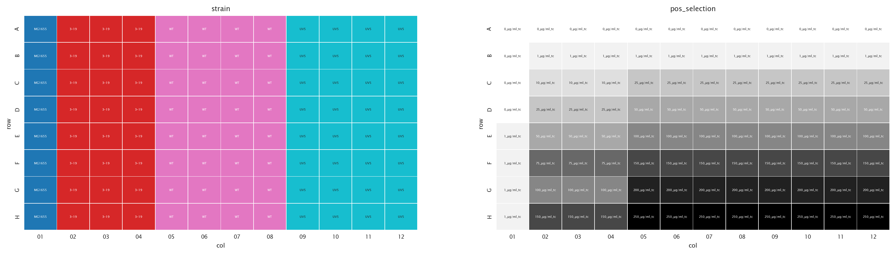
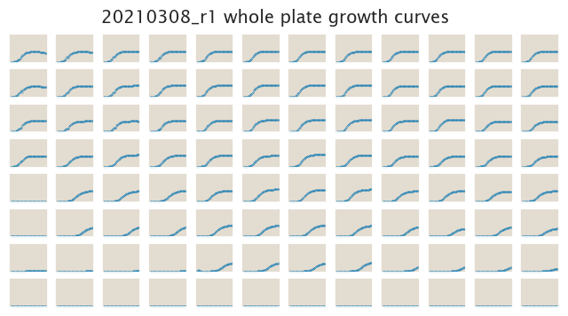
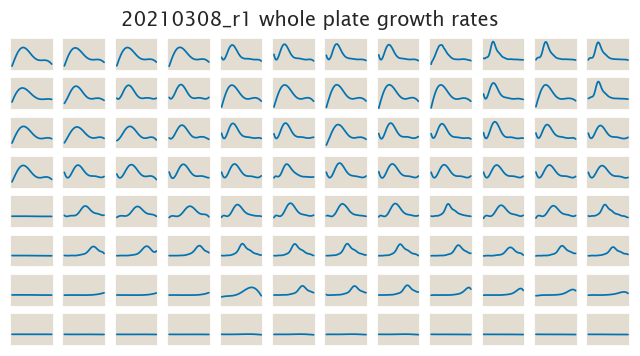

# 2021-03-08 Plate Reader Growth Measurement

## Purpose
This is the first run on the plate reader after we removed the helper Plasmid from ORBIT and confirmed that strong and weak promoter are correctly annotated. This run checks all the boxes for a correct run. We should be able to use this run for first data analysis.

## Strain Information

| Plasmid | Genotype | Host Strain | Shorthand |
| :------ | :------- | ----------: | --------: |
| `None`| wild type |  MG1655 |`MG1655` |
| `None`| `galK<>lac_3.19-tetO2-RiboJ-GFP` |  MG1655 |`319` |
| `None`| `galK<>lac_WT-tetO2-RiboJ-GFP` |  MG1655 |`WT` |
| `None`| `galK<>lac_UV5-tetO2-RiboJ-GFP` |  MG1655 |`UV5` |

## Plate Layout

**96 plate layout**

## Notes & Observations

## Analysis Files

**Whole Plate Growth Curves**

**Whole Plate Growth Rate Inferences**

## Experimental Protocol

1. Cells as described in "Strain Information" were grown to saturation in 4 mL
of LB in an overnight culture.

2. Cells were diluted 1:1,000 into 4ml M9 + 0.5% glucose media around 8am the following day.

3. At 5:30pm the same day, the cells were retrieved from the shaker. Liquid cultures had about 0.7-0.9 OD. The cultures were added
to a 96 well plate with the layout shown above, and diluted such that the initial OD was about 0.01 .

4. The plate was placed in a Biotek Gen5 plate reader and grown at 37C, shaking
in a linear mode at the fastest speed. Measurements were taken every 20 minutes
for approximately 30h at OD600.

## Comments
At first sight at the growth curves on the plate reader, one could see that the strong promoter was slightly weaker than the medium promoter at high concentrations of tetracycline. This might indicate some unexpected interesting behavior if we are able to confirm that the strong promoter indeed leads to higher expression of the downstream genes.