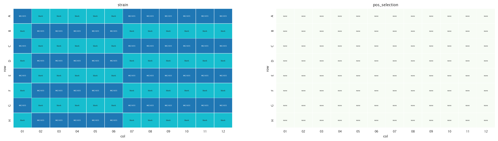
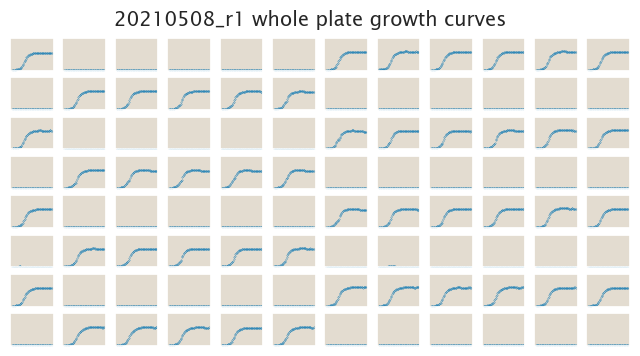
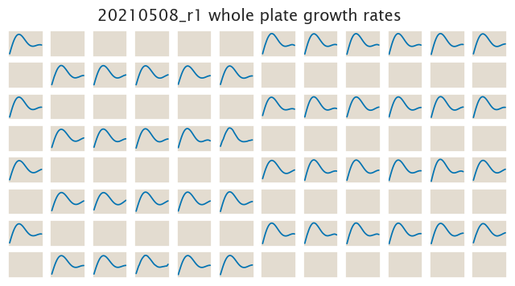

# 2021-05-08 Plate Reader Growth Measurement

## Purpose
This experiment aims to measure the growth rate of wild type *E. coli* (MG1655) across the well plate we are intending on using for future experiments. The goal is to check for potential systematic differences in growth rates across the plate. There are no antibiotics used in this run to have a uniform distribution in growth conditions across the plate
## Strain Information

| Plasmid | Genotype | Host Strain | Shorthand |
| :------ | :------- | ----------: | --------: |
| none | wild type |  MG1655 | MG1655 |

## Plate Layout

**96 plate layout**

## Notes & Observations
The layout was intended to be a checkboard pattern, but Tom was unable to do it, for reasons unknown. 

## Analysis Files

**Whole Plate Growth Curves**

**Whole Plate Growth Rate Inferences**

## Experimental Protocol

1. Cells as described in "Strain Information" were grown to saturation in 5 mL
of LB overnight.

2. Cells were diluted 1:1000 into M9 + 0.5% glucose media the next morning and were grown for 8h at 37C (250rpm).

3. OD600 of the grown culture was measured and then cells were diluted into 300µl of media in the 96 well plate to a final OD of 0.01.

4. The plate was placed in a Biotek Gen5 plate reader and grown at 37C, shaking
in a linear mode at the fastest speed. Measurements were taken every 25 minutes
for approximately 24 hours.
