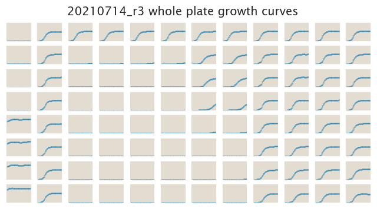
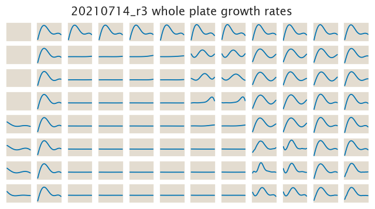

# 2021-07-12 Plate Reader Growth Measurement

## Purpose
This experiment is meant to produce growth rates for all five strains at low concentrations of drug.

## Strain Information

  | Host Strain | Genotype | Shorthand |
| :------ | :------- | ----------: | --------: |
| MG1655| - | MG1655 |
| MG1655| `galK<>3.19kbT+tetO2+RiboJ+tetA+GFP` |3.19|
| MG1655| `galK<>IW+tetO2+RiboJ+tetA+GFP` |IW |
| MG1655| `galK<>WTlac+tetO2+RiboJ+tetA+GFP` |WT |
| MG1655| `galK<>lacUV5+tetO2+RiboJ+tetA+GFP` |UV5 |

## Plate Layout

**96 plate layout**

## Notes & Observations

## Analysis Files

**Whole Plate Growth Curves**

**Whole Plate Growth Rate Inferences**

## Experimental Protocol

1. Cells as described in "Strain Information" were grown to saturation in 5 mL
of LB at 37C overnight.

1. Cells were diluted 1:10 and again 1:100 into M9 + 0.5% glucose media and grown for 7-8h, until an OD of about 0.4 was reached.

2. The cells were then diluted to a final OD of 0.01 into the plate reader 96 well plate with a
total volume of 300 µL.

4. The plate was placed in a Biotek Gen5 plate reader and grown at 37C, shaking
in a linear mode at the fastest speed. Measurements were taken every 20 minutes
for approximately 20 hours.
